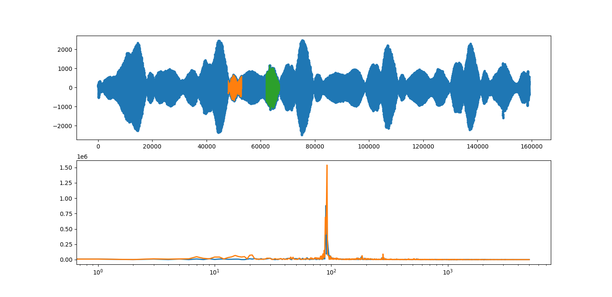

## DopplerGiroGiro

DopplerGiroGiro is moderately simple code for analyzing the doppler shift of an orbitting sound source, using the computer sound card. By measuring the maximum doppler shift, the maximum speed of the source moving towards the observer is determined. Knowing the orbitting frequency, one can convert this velocity to the orbit redius.

This demonstration can be seen as a simple representation of how the separation of binary star systems can be measured by doppler spectroscopy. 

There are some major simplification in the current theoretical model, which can be improved by considering a more sophisticated model. See [project roadmap](./readme.md#roadmap) for future steps and theoretical expansion.

## Installation
For running this code, you need Python3.6+ with Numpy, Matplotlib, and the [pyaudio](https://pypi.org/project/PyAudio/) library installed. Pyaudio is a cross platform package, but some users have experiences hiccups while installing it. 

::TODO:: Create an installation file for this code.  

## Usage

### Measurement
To create new data, use a tone generator app on a smartphone to create a single frequency sound. Rotate your arm at around one cycle per second close to the computer microphone. This will allow make recorded signal easier to analyze as the room echo will not interfere as much with the direct path between source and detector.

### Analysis
To follow the logic of the analysis, follow the jupyter notebook in [examples](./example/simpleorbit.ipynb) 

## Support
There is currently no live support for this project. We will update the code as new versions become available, mainly thanks to the students of the Open Science for Physicists course at Utrecht University.

## Roadmap

### High priorioty
+ automatic detection of start and end of each cycle.
+ add requirement.md for supporting an automatic package installer in PyCharm or other IDEs.

### Nice to have
+ a more sophisticate code that analyzes the doppler shift during the whole trajectory.
+ a simulation code for creating synthetic data based on a simple model to compared with the measurements.

## Contributing
We are not running an active project board for enhancing this code. If you like this exercise and would like to improve the documentation, theory, or code implementation, please send a pull request.

## Authors and acknowledgment
Show your appreciation to those who have contributed to the project.

## License
This project is licensed under __Mozilla Public License Version 2.0__
 

## Project status
This is not an active research project. It is meant to be a didactic example of some good practices for documentation of code.
